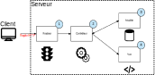

# Projet MVC

Exemple de projet basé sur une architecture MVC.

## Démarrer le projet

1. Installer les dépendances avec composer :
```bash
composer install
```

2. Mettre en place la BDD :
```bash
cd docker-db/
docker compose up
```

> [!NOTE]  
> Il est tout à fait possible de ne pas utiliser Docker pour mettre en place la base de données de ce projet.
> Il vous est alors possible d'utiliser une base de données tournant sur, par exemple, XAMPP.

3. Lancer le serveur de développement :
```bash
php -S localhost:8000 -t public/
```
Liste des paramètres :
- `-S` : adresse et port sur lequel le serveur de développement va être lancé
- `-t` : spécifie le dossier racine de l'application (là où est situé le index.php)

## Ajout d'une page

### Architecture MVC 
Ce projet peut vous servir de base de travail pour une architecture PHP.

Ci-dessous un schéma représentant le principe général de cette architecture :



- **Routeur** :
Reçoit les requêtes HTTP et appelle le bon contrôleur pour traiter les données

- **Contrôleur** :
Intègre le code qui traite les requêtes et effectue la **logique métier** (traitement de données/calcul…) afin de préparer la **vue**.

- **Modèle** :
Regroupe tout ce qui concerne les liens avec la base de données.

- **Vue** :
Correspond à l'interface graphique (HTML + CSS + JS).

### Ajout d'une page

Afin de mieux comprendre dans quel ordre effectuer les opérations de modification, prenons un exemple : nous souhaitons ajouter une page de **contact** permettant de recueillir les messages d'utilisateurs.

Etapes que vous pouvez suivre pour ajouter une telle page (les numéros correspondent à ceux du schéma) :

1. Ajouter une **route** au fichier `Routes.php` : cette route devra faire référence à un nom de controller et une méthode qui sera déclenchée à la réception d'une requête HTTP.
Pour notre exemple :
```php
// Ligne à ajouter à Routes.php
// La classe "ContactController" contenant la méthode "contact" est à créer
$router->addRoute('/contact', ContactController::class, 'contact');
```

2. Ajouter une classe **controller** dans le dossier **Controllers**
```php
class ContactController extends Controller 
{
    // Pour le moment vide, à compléter
}
```
Dans cette classe, ajouter la méthode `contact` (comme dans la méthode `addRoute` lors de l'ajout au `Router`)
```php
class ContactController extends Controller 
{
    public function contact()
    {
        // Code de la méthode à compléter
    }
}
```

Le rôle de cette méthode est de préparer la vue (s'il le faut, elle pourra faire appel à la base de données, dans notre ce ce n'est pas nécessaire).
Pour notre exemple :
```php
class ContactController extends Controller 
{
    public function contact()
    {
        $this->render('Contact');
    }
}
```

3. Ici nous n'avons pas de modèle. Une classe **modèle** est à ajouter dans le cas où le controller est en lien avec la base de données.

4. La vue `Contact` doit être un fichier `php` contenu dans le dossier `Views`.
Toujours pour notre exemple :
```php
<section>
<h1>Formulaire de Contact</h1>
    <form action="contact" method="post">
        <label for="nom">Nom :</label>
        <input type="text" id="nom" name="nom" required>

        <label for="email">Email :</label>
        <input type="email" id="email" name="email" required>

        <label for="message">Message :</label><br>
        <textarea id="message" name="message" rows="4" cols="50" required>
        </textarea>

        <input type="submit" value="Envoyer">
    </form>
<section>
```
